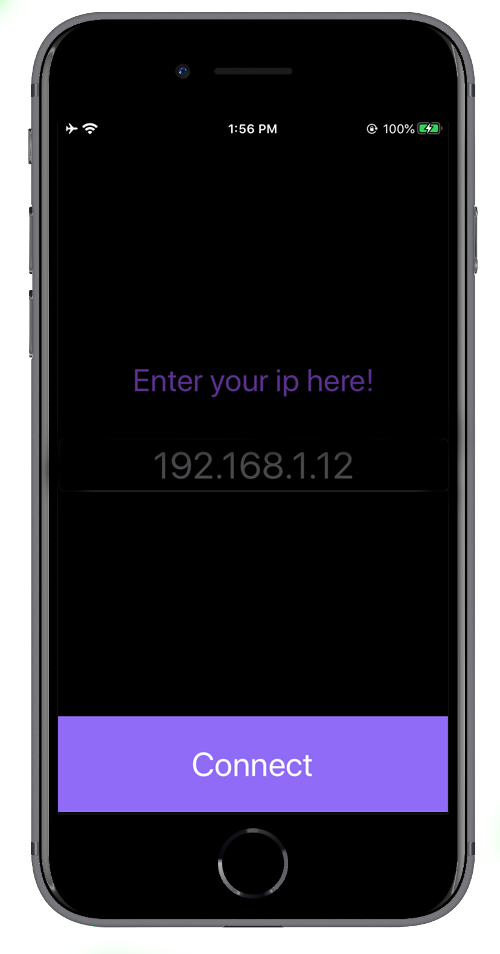
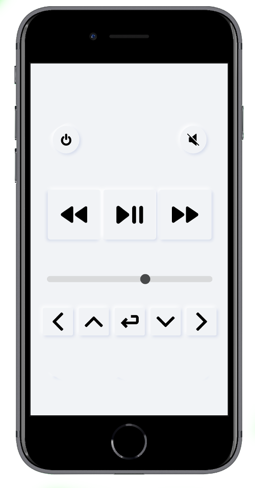
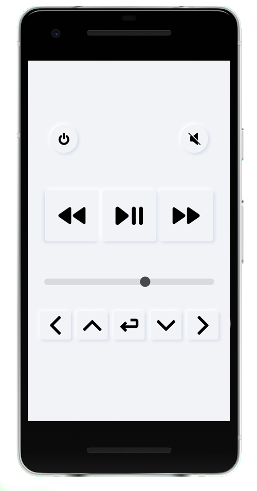

## **RIFI v1.4**
This is the official repo for Wireless Multimedia controller App/Program "RIFI"

Tested on : MacOS | Windows 10 | Manjaro *Linux*

---

##         

  Watch Connect and Player View 
  
   
  
  iOS APP and Web Controller View 
  
    
  Android Web Controller View 
   

---
**Installation**

 git clone [repo](https://github.com/Aayush9029/Rifi.git) or Download .zip/.tar file from the [releases](https://github.com/Aayush9029/Rifi/releases).

 `cd PythonApp`

 `pip install -r requirements.txt`

Complie the watchApp/Remote Controller.xcodeproj and install in apple watch

Or Scan qr code to get acces to web interface.

### Usage:

> `python main.py` *on the host computer*

> *Select Y on show barcode* > *Scan barcode* > Go to the link.

> (For apple watch app) *Open App > input ip of the computer > Save > Scroll to multimedia.*

---

### So how does this work?

- Python stars a local server *using flask (library)* 
  - Port : 8000 (configurable)
  - ip : Local host ip (eg: 192.168.1.4)
- Listens for Inputs (Play/pause, volume up...)
- Performs the keystrokes in the Laptop that is running flask.

Basically this transforms an Apple Watch or a phone to a virtual remote enabling it to controll multimedia.

Uses:

- While Playing a music in laptop (Play/Pause) (Skip) (Volume up/down) 

- While Watching Movie and keyboard/mouse is a bit too far to reach.

- While playing music to skip tracks and since the keystrokes are configurable they can be use to initiate custom shortcuts.

---

*Thanks a lot to*:
- [kvosbur](https://github.com/kvosbur)
